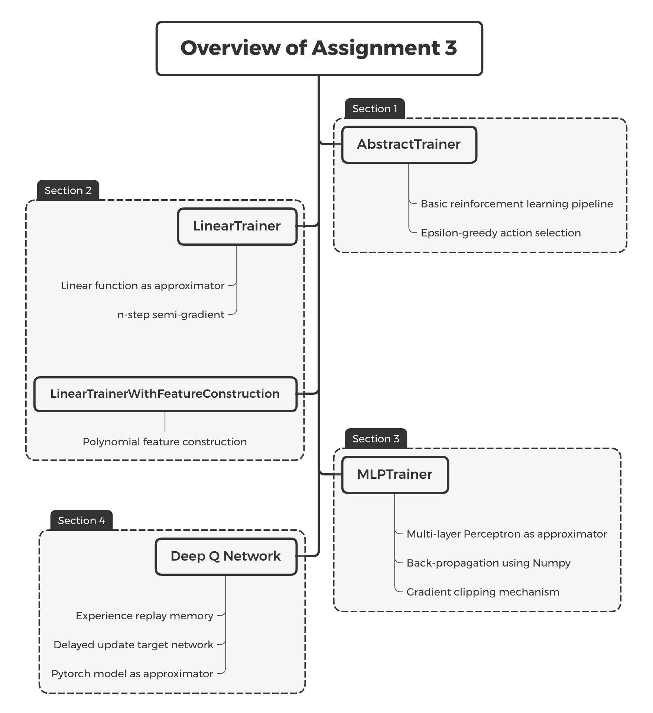

# IERG 5350 Assignment 3: Value Function Approximation in RL

**Due: 11:59 pm, October 28, 2020**

Welcome to the third assignment of this course! The objective of the Assignment 3 is to 

1. Implement serveral approximation techniques.
2. Understand the optimization process of n-step TD control.
3. Implement a simple neural network by Numpy.
4. Get familiar with Pytorch.

The following figure demonstrates the structure of assignment 3. In the first section of notebook, we build a basic RL pipeline. In the second section, we implement the linear function as approximator and also introduce feature construction technique. In the third section, we implement a simple neural network simply using Numpy package. In section 4, we use pytorch to build a nerual network as the approximator and implement the Deep Q Network. The following figure demonstrates the key points and the classes we will implement in each section.

------

*2020-2021 Term 1, IERG 5350: Reinforcement Learning. Department of Information Engineering, The Chinese University of Hong Kong. Course Instructor: Professor ZHOU Bolei. Assignment author: PENG Zhenghao, SUN Hao, ZHAN Xiaohang.*

